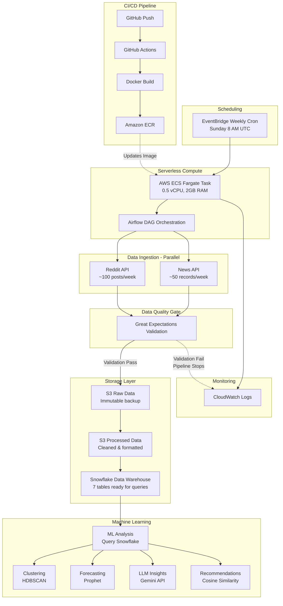

# MindPulseAI: Real-Time Analytics for Mental Health

> A data platform that tracks evolving mental health trends across online discussions and public health data, using machine learning to identify patterns in anxiety and depression.


## Table of Contents
- [Overview](#overview)
- [Tech Stack](#tech-stack)
- [Architecture](#architecture)
- [Project Structure](#project-structure)
- [Data Pipeline](#data-pipeline)
- [ML Models](#ml-models)
- [Infrastructure](#infrastructure)
- [Technical Decisions](#technical-decisions)
- [Challenges & Solutions](#challenges--solutions)
- [Cost Breakdown](#cost-breakdown)

## Overview

Mental health data exists across multiple scattered sources - social media discussions, public health surveys, and search trends. This platform brings these sources together into a unified data warehouse, validates data quality, and uses machine learning to identify patterns that would be invisible in any single source.

### Currently Completed

- ✅ **Automated Data Pipeline**: Weekly ingestion from 2 live APIs (Reddit, News API)
- ✅ **Data Validation**: 7 Great Expectations suites ensuring data quality
- ✅ **Data Warehouse**: 7 datasets in Snowflake (2 live, 4 static)
- ✅ **Serverless Architecture**: Runs on AWS ECS Fargate (cost-friendly)
- ✅ **CI/CD Pipeline**: Automated deployment via GitHub Actions
- ✅ **ML Models**: 4 models validated on production data

### Active Development

- 🚧 Integrating ML models into Airflow for batch predictions
- 🚧 API endpoints for model inference
- 🚧 Interactive dashboard frontend

--- 

## Tech Stack

| Component | Technology | Purpose |
|-----------|-----------|---------|
| **Orchestration** | Apache Airflow | ETL workflow scheduling and dependency management |
| **Compute** | AWS ECS Fargate | Serverless container execution |
| **Storage** | AWS S3 | Raw and processed data lake (7 folders: raw, processed, static) |
| **Data Warehouse** | Snowflake | Clean, queryable datasets with separation of storage/compute |
| **Data Validation** | Great Expectations | Automated data quality checks with 7 validation suites |
| **ML/Analytics** | scikit-learn, Prophet, Gemini API | Clustering, forecasting, LLM insights, recommendations |
| **Backend API** | FastAPI | REST API for serving insights (basic setup complete) |
| **Frontend** | React + Vite | Interactive dashboard (basic setup complete) |
| **Infrastructure** | AWS CDK (Python) | Infrastructure as code for reproducible deployments |
| **CI/CD** | GitHub Actions | Automated Docker build and deployment to ECR/ECS |
| **Monitoring** | AWS CloudWatch | Pipeline execution logs and debugging |
| **Containerization** | Docker | Consistent environments across local/dev/prod |
| **Version Control** | Git + GitHub | Monorepo structure for full-stack project |

### Language & Libraries

- **Python 3.11**: Primary language for pipeline and ML
- **praw**: Reddit API wrapper
- **pytrends**: Google Trends API
- **pandas**: Data transformation
- **boto3**: AWS SDK for S3 operations
- **snowflake-connector-python**: Snowflake integration
- **hdbscan**: Density-based clustering
- **prophet**: Time series forecasting
- **google-generativeai**: Gemini LLM API

--- 
## Architecture

The platform follows a serverless, event-driven architecture for cost efficiency and scalability.

### Data Flow

---
## Project Structure
```
Mental_Health_Project/
├── pipeline/                      # Data ingestion and ETL
│   ├── ingestion/
│   │   ├── base_ingestor.py      # Abstract base class for all ingestors
│   │   ├── ingest_cdc.py         # CDC Household Pulse Survey
│   │   ├── ingest_reddit.py      # Reddit mental health subreddits
│   │   ├── ingest_trends.py      # Google Trends data
│   │   ├── validator.py          # Validator class for GX
│   │   ├── static_ingestor.py    # Base class for static datasets
│   │   └── run_static_ingestion.py # Loads 4 static datasets to Snowflake
│   └── snowflake/
│       ├── load_snowflake.py     # Snowflake connection logic
│       ├── cdc_sql/              # CDC table/stage/load SQL
│       ├── reddit_sql/           # Reddit table/stage/load SQL
│       ├── trends_sql/           # Google Trends table/stage/load SQL
│       └── static/               # Static dataset extraction SQL
│
├── airflow/
│   ├── dags/
│   │   └── ingestion_dag.py      # Main DAG: ingestion → Snowflake loading
│   ├── docker-compose.yaml       # Local Airflow development environment
│   └── keys/                     # Snowflake private key (gitignored)
│
├── analysis/                      # ML models and analysis
│   ├── load_data.py              # Unified Snowflake data loader
│   ├── clustering/
│   │   ├── segment_clustering.ipynb       # HDBSCAN clustering
│   │   └── clustering_utils.py            # Gower distance, evaluation
│   ├── forecasting/
│   │   ├── trend_forecasting.ipynb        # Prophet time series models
│   │   └── forecasting_utils.py           # Model training, evaluation
│   ├── insights/
│   │   ├── llm_summarizer.ipynb           # Gemini API summarization
│   │   └── prompt_templates.py            # LLM prompts
│   ├── recommendations/
│   │   ├── resource_matcher.ipynb         # Similarity-based matching
│   │   └── recommendation_utils.py        # Cosine similarity logic
│   ├── config/
│   │   ├── data_paths.py         # SQL file paths for datasets
│   │   └── model_config.py       # Model hyperparameters
│   ├── utils/
│   │   ├── preprocessing.py      # Feature engineering
│   │   ├── evaluation.py         # Model metrics
│   │   └── visualization.py      # Plotting functions
│   └── models/
│       └── saved_models/         # Serialized models (pkl files)
│
├── gx/                           # Great Expectations
│   ├── expectations/
│   │   ├── cdc_suite.json        # CDC data validation rules
│   │   ├── reddit_suite.json     # Reddit data validation rules
│   │   ├── trends_suite.json     # Google Trends validation rules
│   │   └── [4 static dataset suites]
│   └── uncommitted/              # GX metadata (gitignored)
│
├── infrastructure/               # AWS infrastructure as code
│   ├── app.py                    # CDK app entry point
│   ├── ecs_stack.py              # ECS/Fargate/EventBridge definitions
│   └── requirements.txt          # CDK dependencies
│
├── backend/                      # FastAPI (basic setup)
│   ├── main.py                   # API endpoints
│   ├── Dockerfile                # Backend containerization
│   └── data/                     # Static JSON for testing
│
├── frontend/                     # React + Vite (basic setup)
│   ├── src/
│   │   ├── App.jsx               # Main app component
│   │   └── components/
│   │       └── TimeSeriesChart.jsx  # CDC data visualization
│   └── vite.config.js            # Vite configuration
│
├── .github/
│   └── workflows/
│       └── ci-cd.yaml            # Automated Docker build/deploy
│
├── Dockerfile                    # Production Airflow container
├── docker-compose.yaml           # Local development (not used in prod)
├── requirements.txt              # Python dependencies
├── .env                          # Environment variables (gitignored)
├── .gitignore
└── README.md
```
### Key Design Patterns

- **Monorepo**: All components in one repo for easier change tracking
- **Separation of Concerns**: Pipeline, ML, infrastructure, frontend all isolated
- **Shared Utilities**: `analysis/utils/` used by all ML models
- **Config-Driven**: `config/` folder centralizes paths and hyperparameters
- **Environment-Aware**: Same code works locally, in Docker, and on AWS

## Data Pipeline

> The pipeline runs weekly on Sundays at 8 AM UTC, orchestrated by Apache Airflow on AWS ECS Fargate.

### Data Sources

| Source | API/URL | Update Frequency | Records/Week | Key Metrics |
|--------|---------|------------------|--------------|-------------|
| **Reddit** | PRAW (Reddit API) | Real-time (sampled weekly) | ~100 posts | Subreddit, title, text, score, comments |
| **CDC** | Household Pulse Survey | Weekly | ~50 rows | Anxiety %, depression %, by date |
| **Google Trends** | PyTrends (unofficial API) | Daily (aggregated weekly) | ~30 data points | Search interest for "anxiety", "depression", "therapy" |
| **Static Datasets** | Kaggle, data.gov | One-time load | 1,227 (tech survey) + 3 others | Mental health in tech, suicide statistics |

### Data Validation (Great Expectations)

Each data source has a validation suite that checks:

**CDC Suite (`cdc_suite.json`)**
- ✅ Required columns: `date`, `anxiety`, `depression`, `anxiety_or_depression`
- ✅ Data types: `date` is date, metrics are float
- ✅ Value ranges: All percentages between 0-100
- ✅ No null values in critical columns
- ✅ Dates are sequential (no gaps)

**Reddit Suite (`reddit_suite.json`)**
- ✅ Required columns: `subreddit`, `title`, `text`, `created_utc`, `score`
- ✅ Text fields are strings, timestamps are valid
- ✅ Subreddit is one of: `mentalhealth`, `depression`, `anxiety`
- ✅ Titles and text are non-empty
- ✅ Created dates are recent (within last 30 days)

**Google Trends Suite (`trends_suite.json`)**
- ✅ Required columns: `date`, `keyword`, `interest`
- ✅ Interest values 0-100
- ✅ Keywords are expected terms
- ✅ Weekly data points (no daily granularity)

### Error Handling

- **Validation Failure**: Pipeline stops, logs error to CloudWatch, no data written to Snowflake
- **API Rate Limits**: Retry logic with exponential backoff (3 retries max)
- **S3 Upload Failure**: Logs error, skips Snowflake load for that source
- **Snowflake Connection Issues**: Retry with fresh connection, fail after 3 attempts

### Monitoring

- **CloudWatch Logs**: `/ecs/mental-health` log group captures all stdout/stderr
- **Success Indicators**: Container exit code 0, "Pipeline complete" log message
- **Failure Indicators**: Non-zero exit code, exception traces in logs
- **Data Freshness Check**: Query Snowflake for `MAX(date)` in each table

---

## ML Models

Four machine learning models analyze the data in Snowflake to identify patterns in mental health trends.

### Model 1: Clustering (User Segmentation)

**Purpose**: Group mental health survey respondents into segments based on demographics and treatment history.

**Algorithm**: HDBSCAN (Hierarchical Density-Based Spatial Clustering)
- Chosen over k-means because it doesn't assume spherical clusters and can identify noise points
- Handles mixed categorical + numeric features via Gower distance

**Data Source**: Mental Health in Tech Survey (1,227 responses)

**Features**:
- Categorical: Gender, country, treatment history, company size
- Numeric: Age

**Preprocessing**:
1. Label encode categorical variables
2. Standardize numeric variables
3. Compute Gower distance matrix (accounts for different data types)
4. Apply HDBSCAN with min_cluster_size=50

**Output**: 
- 4-6 user segments (varies based on hyperparameters)
- Segment profiles (demographics, treatment patterns)
- SHAP values for interpretability (which features drive cluster membership)

**Status**: ✅ Validated in notebook, ready for batch deployment

**Notebook**: `analysis/clustering/segment_clustering.ipynb`

---

### Model 2: Forecasting (Trend Prediction)

**Purpose**: Predict future anxiety and depression rates based on historical CDC data.

**Algorithm**: Facebook Prophet
- Handles irregular intervals and missing data better than ARIMA
- Automatically detects seasonality (yearly, weekly patterns)
- Provides uncertainty intervals

**Data Source**: CDC Household Pulse Survey (50+ weeks of data)

**Features**:
- Date (`ds` column in Prophet format)
- Anxiety prevalence rate (`y` column)
- Depression prevalence rate (separate model)

**Preprocessing**:
1. Rename columns to Prophet format (date → `ds`, metric → `y`)
2. Remove outliers (values > 3 standard deviations)
3. Ensure weekly frequency (fill missing dates with interpolation)

**Training**:
- 80/20 train/test split (chronological)
- Fit Prophet with yearly + weekly seasonality
- Generate 90-day forecast with confidence intervals

**Evaluation Metrics**:
- MAE (Mean Absolute Error)
- RMSE (Root Mean Squared Error)
- MAPE (Mean Absolute Percentage Error)

**Output**:
- 90-day forecast for anxiety and depression rates
- Upper/lower confidence bounds
- Trend components (overall trend, seasonal patterns)

**Limitations**:
- Assumes historical patterns continue (external shocks like pandemics not predicted)
- Limited historical data (1-2 years) constrains accuracy
- Population-level trends only (not individual predictions)

**Status**: ✅ Validated in notebook, ready for batch deployment

**Notebook**: `analysis/forecasting/trend_forecasting.ipynb`

---

### Model 3: LLM Insights (Sentiment Analysis)

**Purpose**: Generate natural language summaries of mental health discussions on Reddit.

**Algorithm**: Google Gemini API (gemini-pro model)
- LLM-powered text generation
- Structured prompt engineering for mental health context

**Data Source**: Reddit posts from `r/mentalhealth`, `r/depression`, `r/anxiety`

**Preprocessing**:
1. Sample 20 random posts per run (API token limits)
2. Truncate titles to 100 characters, text to 200 characters
3. Format as "Subreddit: Title | Text" blocks
4. Batch process all posts in single API call (provides context)

**Prompt Engineering**:
- Custom prompts in `analysis/insights/prompt_templates.py`
- Instructions to avoid diagnostic language
- Focus on themes, sentiment patterns, common topics
- Request actionable insights (not just summaries)

**Output**:
- Natural language summary of Reddit sentiment
- Identified themes (e.g., "isolation during holidays", "medication side effects")
- Sentiment trends (positive/negative/neutral prevalence)

**Limitations**:
- Hallucination risk (LLM may generate plausible but false patterns)
- Small sample size (20 posts) may miss broader trends
- Single-point analysis (doesn't capture changes over time)
- Privacy: Sends public Reddit data to external API

**Status**: ✅ Validated in notebook, ready for batch deployment

**Notebook**: `analysis/insights/llm_summarizer.ipynb`

---

### Model 4: Recommendations (Resource Matching)

**Purpose**: Match users to relevant mental health resources based on similarity to survey responses.

**Algorithm**: Cosine similarity on encoded categorical features
- Simple, interpretable approach
- Avoids diagnostic categorization (ethical design choice)

**Data Source**: Mental Health in Tech Survey (1,227 responses)

**Features**:
- Treatment history (currently in treatment, previously treated, never treated)
- Demographics (gender, age bracket, country)
- Work environment (company size, remote vs. in-office)

**Preprocessing**:
1. One-hot encode categorical features with `pandas.get_dummies()`
2. For new user: Encode input with same schema
3. Calculate cosine similarity between new user and all survey respondents

**Matching Logic**:
1. Find responses with similarity > 0.3 (threshold tunable)
2. Extract resource patterns from similar responses
3. Rank resources by frequency in similar responses
4. Fallback: Return general mental health resources if no matches

**Output**:
- Ranked list of relevant resources (therapy types, support groups, crisis lines)
- Explanation of match (based on similar demographics/treatment history)
- Similarity scores for transparency

**Ethical Design**:
- ❌ No diagnostic categorization or mental health labeling
- ❌ No assumption of static psychological states
- ✅ Emphasizes situational similarity (workplace stress, treatment history)
- ✅ General suggestions, not clinical advice
- ✅ Includes crisis resources as fallback

**Limitations**:
- Small dataset (1,227 responses) limits diversity of matches
- Demographic similarity ≠ resource relevance for complex needs
- Static survey (doesn't capture evolving needs)

**Status**: ✅ Validated in notebook, ready for batch deployment

**Notebook**: `analysis/recommendations/resource_matcher.ipynb`

---

### Model Deployment Strategy (In Progress)

**Current State**: All models validated in Jupyter notebooks querying Snowflake

**Planned Approach**: Batch predictions in Airflow DAG
1. Add model training/inference tasks to `ingestion_dag.py`
2. Run weekly after Snowflake loading completes
3. Save predictions to new Snowflake tables:
   - `CLUSTERING_RESULTS` (segment assignments)
   - `FORECAST_PREDICTIONS` (90-day anxiety/depression forecasts)
   - `REDDIT_INSIGHTS` (LLM summaries)
   - `RESOURCE_RECOMMENDATIONS` (pre-computed for common profiles)
4. API queries these result tables (no real-time inference needed)

**Why Batch Over Real-Time**:
- Data refreshes weekly (no need for real-time inference)
- Simpler deployment (no model serving infrastructure)
- Cost-effective (compute only during weekly run)
- Predictions stored in Snowflake (fast API queries)

---

## Infrastructure

All infrastructure is defined as code using AWS CDK (Python) and deployed via GitHub Actions.

### AWS Architecture

**Components**:
- **VPC**: Isolated network with public subnets (for Fargate tasks)
- **ECS Cluster**: Container orchestration (cluster name: `mental-health-cluster`)
- **ECR Repository**: Docker image storage (`mental-health-pipeline`)
- **ECS Task Definition**:
  - CPU: 0.5 vCPU
  - Memory: 2 GB
  - Image: Latest from ECR
  - Environment variables: Snowflake credentials, Reddit API keys, AWS keys
- **EventBridge Rule**: Cron schedule (`cron(0 8 * * 1)` = Sunday 8 AM UTC)
- **IAM Roles**:
  - Task execution role (pull image from ECR, write logs to CloudWatch)
  - Task role (access S3 buckets)
- **CloudWatch Log Group**: `/ecs/mental-health` (retention: 7 days)

**Infrastructure Code**: `infrastructure/ecs_stack.py`

### Deployment Process

**Local Development**:
```bash
# Run Airflow locally with Docker Compose
cd airflow
docker-compose up

# Access Airflow UI at localhost:8080
# Username: atremante | Password: [from setup]
```
**Production Deployment**:
```bash
# Build Docker image
docker build --platform linux/amd64 -t mental-health-pipeline .

# Tag for ECR
docker tag mental-health-pipeline:latest \
  [account-id].dkr.ecr.us-east-1.amazonaws.com/mental-health-pipeline:latest

# Push to ECR
aws ecr get-login-password --region us-east-1 | \
  docker login --username AWS --password-stdin \
  [account-id].dkr.ecr.us-east-1.amazonaws.com

docker push [account-id].dkr.ecr.us-east-1.amazonaws.com/mental-health-pipeline:latest

# Deploy infrastructure
cd infrastructure
cdk deploy
```

**Automated CI/CD (GitHub Actions)**:
```yaml
# .github/workflows/ci-cd.yaml
on:
  push:
    branches: [main]

jobs:
  deploy:
    - Checkout code
    - Build Docker image
    - Push to ECR
    - Update ECS task definition with new image
    - Force new ECS deployment
```
### Docker Configuration
Two Docker Setups:

1. Development (airflow/docker-compose.yaml):
- Multi-container setup: Postgres, Redis, Airflow webserver, scheduler, worker
- Persistent UI at localhost:8080
- Volume mounts for live code editing
- Used for: Local testing, DAG development

Production (Dockerfile in root):
- Single container with Airflow + dependencies
- Runs DAG once, then exits
- No UI (logs to CloudWatch)
- Used for: ECS Fargate batch jobs

Key Difference: Dev runs 24/7 for interaction, prod runs ~16 seconds once/week

## Technical Decisions

### Why Serverless Airflow?

**Traditional Approach**:
- Run Airflow on EC2 instance 24/7
- Cost: $50-100/month for t3.medium
- Overhead: Manage server, updates, scaling

**My Approach**:
- ECS Fargate runs Airflow as batch job
- Triggered weekly by EventBridge
- Container runs ~16 seconds, then terminates
- Cost: ~$0/month for compute

**Trade-off**: No persistent UI for monitoring, but CloudWatch logs provide visibility. For weekly batch jobs, 24/7 UI is unnecessary.

---

### Why Snowflake Over PostgreSQL/RDS?

**Snowflake Benefits**:
- **Separation of storage and compute**: Pay per query, not per hour
- **Auto-scaling**: Warehouse scales up if queries get complex
- **Zero maintenance**: No server patching, backup configuration
- **Query performance**: Columnar storage optimized for analytics

**PostgreSQL Costs**:
- RDS db.t3.small: ~$30/month (24/7)
- Need backups, connection pooling, query optimization

**Snowflake Costs**:
- X-Small warehouse: ~$2/credit
- Auto-suspend after 5 minutes idle
- Free tier covers initial usage
- Actual cost: $0-5/month with careful use

**Trade-off**: Snowflake has query costs, but for low-frequency analytics (weekly ingestion + occasional ML queries), it's far cheaper than 24/7 database hosting.

---

### Why Great Expectations?

**The Problem**: Bad data breaks ML models
- Missing values cause inference errors
- Wrong data types crash pipelines
- Out-of-range values bias predictions

**Great Expectations Solution**:
- Automated validation before warehousing
- Failed expectations stop pipeline (don't write bad data)
- Versioned expectation suites (track data contract changes)
- Documentation of data quality (generates reports)

**Alternative Considered**: Manual validation with `pandas` asserts
- Harder to maintain (spread across code)
- No documentation/reporting
- Less expressive (harder to specify complex rules)

---

### Why Monorepo Structure?

**Benefits**:
- Single source of truth for all code
- Easier dependency management (one `requirements.txt`)
- Atomic commits across pipeline/ML/infra
- Simplified CI/CD (one workflow)

**Alternative**: Separate repos for pipeline, ML, infra, frontend
- Harder to coordinate changes
- Duplicate dependencies
- Multiple CI/CD workflows

**Trade-off**: Monorepo can get large, but for a solo project, the coordination benefits outweigh size concerns.

---

### Why Weekly Schedule (Not Daily)?

**Reasoning**:
- Mental health trends evolve slowly (not hourly/daily)
- CDC data updates weekly
- Reddit/Trends data accumulates over time (weekly aggregation sufficient)
- Cost: 1/7th of daily runs

**Alternative Considered**: Real-time streaming
- Would require Kafka/Kinesis (~$50+/month)
- Lambda functions for processing
- Overkill for population-level trend analysis

---

### Why Jupyter Notebooks for ML?

**Benefits**:
- Exploratory analysis (visualize data, try different approaches)
- Documentation (markdown cells explain reasoning)
- Easy iteration (rerun cells without full script)
- Shareable (reviewers can see thought process)

**Production Integration Plan**:
- Convert notebooks to Python modules (keep core logic)
- Schedule as Airflow tasks (batch predictions)
- Notebooks remain as documentation/experimentation layer

---

### Why Batch Predictions (Not Real-Time API)?

**Current Plan**: Run models weekly in Airflow, save predictions to Snowflake

**Benefits**:
- Simpler deployment (no model serving infrastructure)
- Cost-effective (compute only during weekly run)
- Fast API queries (read pre-computed predictions from Snowflake)

**Trade-off**: Predictions potentially 7 days stale, but acceptable for population trends (not real-time recommendations).

**Alternative Considered**: FastAPI + model loading
- Would need persistent API server ($7-20/month)
- Model loading adds latency to API calls
- Over-engineered for weekly-refreshing data

---

### Why Docker Compose AND Dockerfile?

**Two Use Cases**:

**Docker Compose (`airflow/docker-compose.yaml`)**:
- **Purpose**: Local development with full Airflow UI
- **Containers**: Postgres, Redis, webserver, scheduler, worker
- **When to use**: Testing DAGs, debugging, interactive development

**Dockerfile (project root)**:
- **Purpose**: Production single-container batch job
- **Container**: Airflow + pipeline code
- **When to use**: ECS Fargate scheduled execution

**Why Both**: Different deployment contexts need different setups. Compose for dev interactivity, Dockerfile for prod efficiency.

---

## Challenges & Solutions

### Challenge 1: Path Resolution Across Environments

**Problem**:
Jupyter notebooks in `analysis/clustering/` couldn't import modules from `analysis/` or `pipeline/`.

```python
from analysis.load_data import load_dataset  # ModuleNotFoundError
```

**Root Cause**:
- Notebooks executed from subdirectory (`analysis/clustering/`)
- Python looked for modules relative to notebook location
- `sys.path` didn't include project root

**Solution**:

In `analysis/load_data.py`:
```python
from pathlib import Path

# Resolve absolute path to project root
_current_file = Path(__file__).resolve()
PROJECT_ROOT = _current_file.parent.parent
sys.path.insert(0, str(PROJECT_ROOT))
```

In notebooks:
```python
from pathlib import Path
import sys

# Add project root to path
PROJECT_ROOT = Path.cwd().parent.parent
sys.path.insert(0, str(PROJECT_ROOT))

from analysis.load_data import load_dataset  # Now works
```

**Key Insight**: Use `.resolve()` to get absolute paths before calculating `parent`. This works regardless of where code is executed from.

---

### Challenge 2: Snowflake Authentication in Notebooks

**Problem**:
Regular Snowflake login requires MFA (multi-factor authentication), which doesn't work in programmatic contexts (scripts, notebooks).

**Solution**: Key-pair authentication with RSA private key

1. Generate key pair:
```bash
openssl genrsa -out rsa_key.pem 2048
openssl rsa -in rsa_key.pem -pubout -out rsa_key.pub
openssl pkcs8 -topk8 -inform PEM -in rsa_key.pem \
  -outform DER -nocrypt -out rsa_key.p8
```

2. Upload public key to Snowflake:
```sql
ALTER USER your_user SET RSA_PUBLIC_KEY='MIIBIjANBgk...';
```

3. Use private key in code:
```python
from cryptography.hazmat.backends import default_backend
from cryptography.hazmat.primitives import serialization

with open(os.getenv("SNOWFLAKE_PRIVATE_KEY_PATH"), 'rb') as key:
    private_key = serialization.load_pem_private_key(
        key.read(),
        password=None,
        backend=default_backend()
    )

conn = snowflake.connector.connect(
    user=user,
    account=account,
    private_key=private_key,
    # No password needed
)
```

**Environment-Specific Paths**:
- Local: `.env` has `/Users/Andrew/.../keys/rsa_key.p8`
- Docker: `SNOWFLAKE_PRIVATE_KEY_PATH=/opt/airflow/keys/rsa_key.p8`
- ECS: Same as Docker

---

### Challenge 3: S3-Snowflake Storage Integration

**Problem**:
Snowflake needs to read data from S3, but S3 buckets are private. How does Snowflake authenticate?

**Solution**: Storage Integration with IAM Role Trust Policy

**Step 1**: Create IAM role in AWS
```json
{
  "Version": "2012-10-17",
  "Statement": [{
    "Effect": "Allow",
    "Action": ["s3:GetObject", "s3:ListBucket"],
    "Resource": [
      "arn:aws:s3:::mental-health-project-pipeline",
      "arn:aws:s3:::mental-health-project-pipeline/*"
    ]
  }]
}
```

**Step 2**: Create storage integration in Snowflake
```sql
CREATE STORAGE INTEGRATION s3_int
  TYPE = EXTERNAL_STAGE
  STORAGE_PROVIDER = S3
  ENABLED = TRUE
  STORAGE_AWS_ROLE_ARN = 'arn:aws:iam::account-id:role/snowflake_s3_access'
  STORAGE_ALLOWED_LOCATIONS = ('s3://mental-health-project-pipeline/');
```

**Step 3**: Get Snowflake's AWS account ID and external ID
```sql
DESC INTEGRATION s3_int;
-- Returns: STORAGE_AWS_IAM_USER_ARN and STORAGE_AWS_EXTERNAL_ID
```

**Step 4**: Update IAM role trust policy
```json
{
  "Version": "2012-10-17",
  "Statement": [{
    "Effect": "Allow",
    "Principal": {
      "AWS": "arn:aws:iam::SNOWFLAKE_ACCOUNT:user/SNOWFLAKE_USER"
    },
    "Action": "sts:AssumeRole",
    "Condition": {
      "StringEquals": {
        "sts:ExternalId": "EXTERNAL_ID_FROM_SNOWFLAKE"
      }
    }
  }]
}
```

**Key Insight**: The external ID prevents confused deputy attacks. Only Snowflake with the correct external ID can assume the role.

**Took 3-4 iterations to get all the ARNs, external IDs, and permissions exactly right.**

---

### Challenge 4: Docker Multi-Environment Setup

**Problem**:
Great Expectations looks for project config at `gx/` relative to working directory, but working directory differs:
- Local: `/Users/Andrew/.../Mental_Health_Project/`
- Docker: `/opt/airflow/`

**Solution**: Update `validator.py` to handle both
```python
import os
from pathlib import Path
import great_expectations as gx

def get_gx_context():
    # Check if running in Docker
    if os.path.exists('/opt/airflow/gx'):
        context_root_dir = '/opt/airflow/gx'
    else:
        # Local development
        context_root_dir = str(Path(__file__).resolve().parent.parent / 'gx')
    
    return gx.get_context(context_root_dir=context_root_dir)
```

**Also needed to update `docker-compose.yaml`**:
```yaml
volumes:
  - ../gx:/opt/airflow/gx  # Mount GX directory into container
```

---

### Challenge 5: Module Imports Across Pipeline

**Problem**:
`load_snowflake.py` needed by both pipeline scripts and analysis notebooks, but imports were failing.

**Root Cause**:
- Missing `__init__.py` files in directories
- `sys.path` not configured consistently

**Solution**:

1. Add `__init__.py` to all directories:
```bash
touch pipeline/__init__.py
touch pipeline/ingestion/__init__.py
touch pipeline/snowflake/__init__.py
touch analysis/__init__.py
# etc.
```

2. Standardize path setup at top of all scripts:
```python
from pathlib import Path
import sys

PROJECT_ROOT = Path(__file__).resolve().parent.parent
sys.path.insert(0, str(PROJECT_ROOT))
```

3. Use absolute imports everywhere:
```python
# Good
from pipeline.snowflake.load_snowflake import snowflake_connection

# Bad (relative imports)
from ..snowflake.load_snowflake import snowflake_connection
```

---

### Challenge 6: Environment Variable Management

**Problem**:
Same credentials needed in 3 different contexts:
- Local development (`.env` file)
- Docker Compose (environment variables)
- ECS Fargate (task definition)

**Solution**: Created consistent environment variable names, loaded differently per context

**Local (`.env` file)**:
```bash
SNOWFLAKE_PRIVATE_KEY_PATH=/Users/Andrew/.../keys/rsa_key.p8
```

**Docker Compose (`docker-compose.yaml`)**:
```yaml
environment:
  SNOWFLAKE_PRIVATE_KEY_PATH: /opt/airflow/keys/rsa_key.p8
volumes:
  - ./keys:/opt/airflow/keys
```

**ECS (`infrastructure/ecs_stack.py`)**:
```python
environment={
    "SNOWFLAKE_PRIVATE_KEY_PATH": "/opt/airflow/keys/rsa_key.p8",
    # ... other vars
}
```

**Key Insight**: Use environment variables for all secrets/paths. Never hardcode. Each environment sets its own values.

---

## Cost Breakdown

### Monthly Infrastructure Costs

| Service | Tier/Size | Usage | Monthly Cost | Notes |
|---------|-----------|-------|--------------|-------|
| **AWS ECS Fargate** | 0.5 vCPU, 2GB RAM | ~16 sec/week | **~$0** | 0.5 vCPU × 2GB × 16 sec × 4 weeks = negligible |
| **AWS S3** | Standard | ~2GB storage, 100 requests/week | **$0-2** | Free tier: 5GB storage, 20K GET, 2K PUT requests/month |
| **Snowflake** | X-Small warehouse | ~5 min/week compute | **$0-5** | Free credits, auto-suspend after 5 min idle |
| **AWS ECR** | Standard | ~500MB image | **$0** | Free tier: 500MB storage |
| **AWS CloudWatch** | Standard | ~1GB logs/month | **$0** | Free tier: 5GB ingestion, 5GB storage |
| **EventBridge** | Standard | 4 triggers/month | **$0** | Free tier: 1M events/month |
| **GitHub Actions** | Standard | ~10 min build time/push | **$0** | Free tier: 2,000 min/month |
| **Gemini API** | Pay-per-token | ~1,000 API calls/month | **$5-10** | Depends on prompt/response length |
| **Render (API)** | Free tier | Minimal usage | **$0-7** | Currently unused, may upgrade for production API |
| **GitHub Pages** | Free | Static site hosting | **$0** | Always free |
| | | **TOTAL** | **$12-25/month** | Production-grade data platform |

---

### Cost Optimization Strategies

**Serverless Architecture**
- No 24/7 infrastructure (pay only for actual compute time)
- ECS Fargate runs ~16 seconds/week vs 168 hours (99.97% cost reduction vs EC2)
- EventBridge scheduling (no Airflow scheduler running 24/7)

**Auto-Suspend & Auto-Scale**
- Snowflake warehouse suspends after 5 minutes idle
- Start small (X-Small warehouse), scale up only if needed
- S3 lifecycle policies (archive or delete old data after 90 days)

**Free Tiers**
- Maximized use of AWS free tier (S3, ECR, CloudWatch, EventBridge)
- GitHub Actions free tier (2,000 minutes/month)
- GitHub Pages free tier (static hosting)
- Snowflake free credits ($400 initial credit)

**Efficient Scheduling**
- Weekly instead of daily (1/7th the cost)
- Batch processing instead of real-time streaming (no Kinesis/Kafka costs)
- Single DAG run handles all data sources (parallelized within one execution)

**Data Sampling**
- LLM only processes 20 Reddit posts/week (not all posts)
- Reduces API token costs while maintaining insights quality
- Could increase sampling if budget allows

---

### Cost Scaling Projections

**If daily ingestion needed** (7x frequency):
- ECS Fargate: Still ~$0 (112 sec/week vs 16 sec/week)
- Snowflake: $5-10/month (more frequent COPY INTO operations)
- Gemini API: $35-70/month (7x API calls)
- **Total**: $50-90/month

**If real-time streaming needed**:
- Add Kinesis Data Streams: ~$50/month
- Add Lambda functions: ~$10/month
- Add DynamoDB for state: ~$10/month
- **Total**: $130-180/month

**Current architecture optimized for batch processing, not streaming. Weekly schedule keeps costs minimal while providing valuable insights.**
